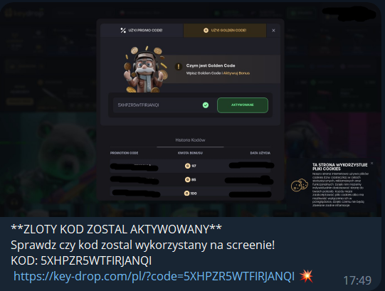

# KeydropGoldenCode
Auto redeem codes to keydrop

# how to use?
1. Join to server: https://discord.gg/ctUEVsRg
2. Download nodejs
3. Clone this project and open cmd
4. write **npm i** in cmd
5. open telegram and create bot
6. Open config.json and write all information (how to get your discord token https://youtu.be/YEgFvgg7ZPI)
7. Download extension https://chrome.google.com/webstore/detail/%E3%82%AF%E3%83%83%E3%82%AD%E3%83%BCjson%E3%83%95%E3%82%A1%E3%82%A4%E3%83%AB%E5%87%BA%E5%8A%9B-for-puppet/nmckokihipjgplolmcmjakknndddifde?hl=ja
8. go to key-drop.com, download cookies with this extension and rename this .json file to keydrop.json
9. drag this file into cookies folder
10. Write **node index.js** into cmd

 
if u see this message, bot works!

# commands

/info - your profile (gold, money)

# images

